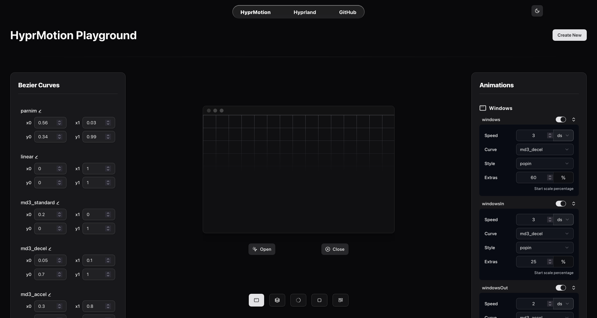

# HyprMotion

Visualize [Hyprland](https://hypr.land/) animations with ease

## What is this

HyprMotion is a static web app that helps you design hyprland animations. It allows you to import your animation config, or create a new one from scratch.
You can edit or add new bezier curves, and tweak each and every animation while visualizing how it really looks.

## How to use

Right now you can upload your `.conf` file containing exactly one animation block (or the first one will be read), or paste the content directly.
After being implemented, you can paste a file url too. It will then open the Playground, where you can edit beziers, edit animations and preview them.

## Tech Stack

HyprMotion is built with [SvelteKit](https://svelte.dev/) and it works fully offline and on-device with absolutely no internet connections made after the first load (no telemetry, server storage etc).
It is hosted on GitHub pages as a static website.

> [!WARNING]
> HyprMotion is still under heavy development, and some features may not be fully functional yet.

## Plans

Right now it barely displays window open/close animations with editable bezier curves. I want this to allow making your own curves easily (via graphs or maybe generative AI?).
Eventually I want to support all hyprland animations (layers, workspaces etc.). Finally being able to export the created animation config.

Maybe an online gallery to share animations, but that would require an server. Even if done, the main HyprMotion Playground would be fully local and on-device, only uploading would make an internet connection.
